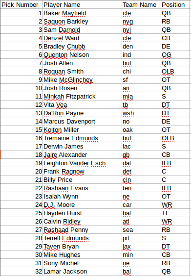
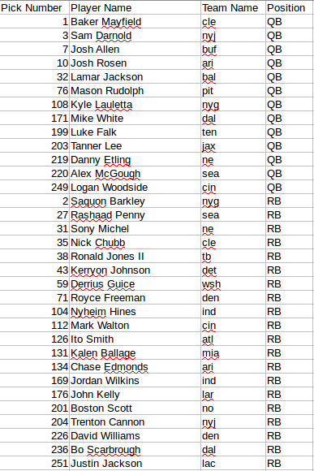
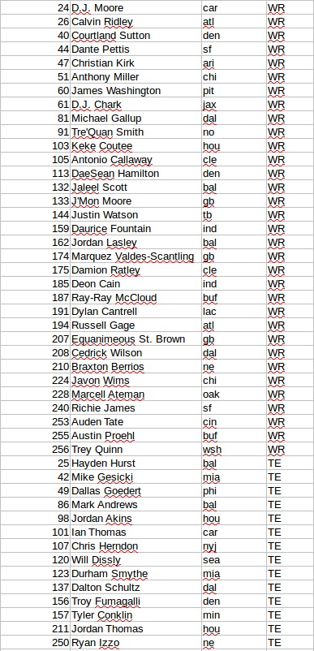
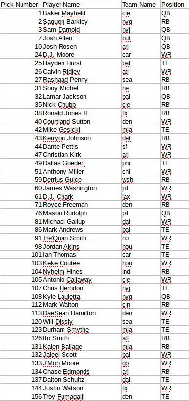
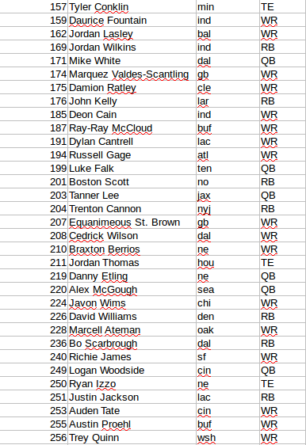

# 2018 NFL Rookie Draft

# Extracted Complete Draft Order from ESPN

scrape_espn.py was created to pull the 2018 draft order from ESPN's website.  If you run that script you will extract information about all players (including defense) from all 7 rounds into a .csv similar to the format below.  The .csv is also saved in this repository ESPN_Draft_Order_Scrape.csv. 

Below is an image showing only the first round, but data from all 7 rounds is in the .csv.

# Filtering by position

The players filtered by position (QB,RB,WR,TE) is shown below and also contained in: Filtered_ESPN_Draft_Order.csv

# Sorting by pick #:

The players filtered by position (QB,RB,WR,TE) and sorted in the order that those players were drafted is displayed below and also contained in: Sorted_Filtered_ESPN_Draft_Order.csv

